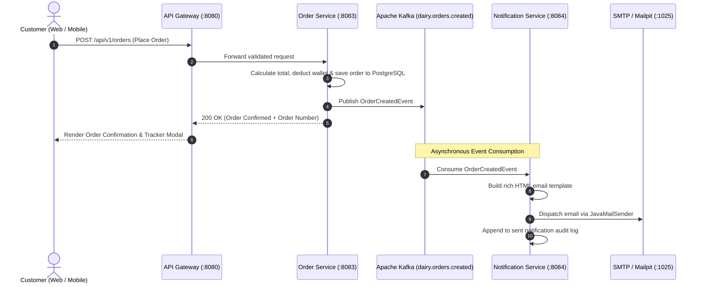

# 🏛️ Bangalore Dairy Platform - Technical Architecture Specification

This document describes the design principles, asynchronous event-driven flows, database schemas, and microservice interactions implemented in the Bangalore Dairy platform.

---

## 1. Architectural Style & Design Principles

The platform follows a **Domain-Driven, Event-Driven Microservices Architecture (EDA)** with the following core tenets:

1. **Loose Coupling via Kafka**: Order creation, inventory reservation, and customer email alerts communicate asynchronously over Kafka topics without tight temporal coupling.
2. **Read Performance with Redis**: Frequent reads of dairy products and category menus are cached in Redis with automated eviction on updates.
3. **Dual Persistence Strategy**:
   - **PostgreSQL / MySQL**: ACID relational consistency for transactions, user identities, orders, subscriptions, and financial ledgers.
   - **MongoDB**: Semi-structured document storage for dispatch logs, milk testing metrics, and delivery partner GPS trails.
4. **Resilience & Graceful Fallback**: Microservices use fallback configurations (e.g. in-memory H2 databases and local simulated notification stores) when external brokers are offline.

---

## 2. Asynchronous Order Flow (Sequence Diagram)



---

## 3. Daily Milk Subscription Scheduling Algorithm

```
                 9:00 PM IST (Cutoff Window)
                             │
                             ▼
              [ Collect Active Subscriptions ]
                             │
                             ▼
                 [ Check Wallet Balance ]
                  ├── Sufficient ──▶ [ Generate Morning Order & Emit Kafka Event ]
                  └── Low Funds  ──▶ [ Send Wallet Recharge Alert Email ]
                             │
                             ▼
         [ 5:30 AM - 7:00 AM Doorstep Delivery Execution ]
```

---

## 4. Database Relational Schema

```
+---------------+        +------------------+        +-------------------+
|     USERS     |        |   SUBSCRIPTIONS  |        |      ORDERS       |
+---------------+        +------------------+        +-------------------+
| id (PK)       |<───┐   | id (PK)          |   ┌───>| id (PK)           |
| name          |    └───| user_id (FK)     |   │    | order_number      |
| email         |        | product_id (FK)  |   │    | user_id (FK)      |
| password      |        | quantity         |   │    | total_amount      |
| phone         |        | frequency        |   │    | delivery_slot     |
| wallet_balance|        | delivery_slot    |   │    | payment_status    |
| role          |        | status           |   │    +---------+---------+
+---------------+        +------------------+   │              │
                                                │              ▼
+---------------+        +------------------+   │    +-------------------+
|  CATEGORIES   |        |     PRODUCTS     |   │    |    ORDER_ITEMS    |
+---------------+        +------------------+   │    +-------------------+
| id (PK)       |<───────| id (PK)          |   │    | id (PK)           |
| name          |        | category_id (FK) |   │    | order_id (FK)     |
| slug          |        | name             |   │    | product_id (FK)   |
| display_order |        | price            |   │    | unit_price        |
+---------------+        | fat_content      |   └───>| total_price       |
                         | supports_sub     |        +-------------------+
                         +------------------+
```
