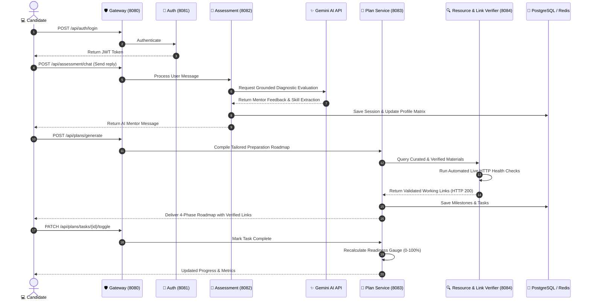

# 🏛️ InterviewCraft AI – Architecture & Technical Blueprint

## 1. System Context & Component Interaction

## 2. Link Verification & Content Quality Assurance Pipeline

1. **URL Normalization**: Strips invalid prefixes, formats standard HTTPS schema, extracts domain authority.
2. **Asynchronous HTTP Health Probing**:
   - Executes non-blocking `HEAD` request with browser-like user agent.
   - If `HEAD` is rejected (e.g. 405/403 on anti-scraping platforms), triggers controlled `GET` probe.
   - Follows redirect paths ($301/302$) to resolve canonical destinations.
3. **Content & DOM Validation**:
   - Parses HTML `<title>` tag and verifies `Content-Type` headers via JSoup.
   - Assigns Domain Trust tiers (`HIGH` for established tech portals: `dataintensive.net`, `bytebytego.com`, `youtube.com`, `baeldung.com`, `refactoring.guru`, `leetcode.com`).
4. **Resilience & Zero Hallucination Guarantee**:
   - If an AI model hallucinated a nonexistent URL or dead page, the verification engine intercepts the response, tags it as unreachable, and substitutes it with the closest verified gold-standard material from the curated repository.

---

## 3. Database Schema Overview

- **`users`**: Candidate authentication credentials (BCrypt), target role, years of experience, tech stacks.
- **`chat_sessions`** & **`chat_messages`**: Multi-turn dialogue history, session status, extracted JSON profile.
- **`interview_plans`**, **`plan_milestones`**, **`plan_tasks`**: Multi-week roadmap hierarchy, day-by-day tasks, category tags, completion booleans.
- **`verified_resources`**: Validated educational catalog with URLs, HTTP status codes, latency metrics, and verification badges.
