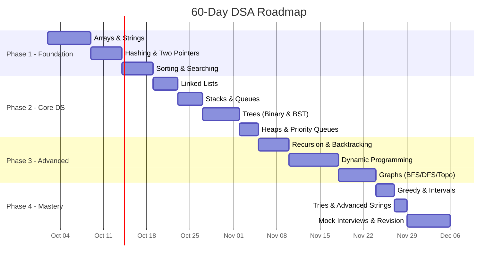

# 🚀 60-Day DSA Interview Preparation Plan (Java)

> **Start Date:** October 2, 2026 → **Target Date:** December 1, 2026
> **Daily Commitment:** 3–4 hours (weekdays) | 5–6 hours (weekends)
> **Platform:** LeetCode (primary), GeeksforGeeks, Codeforces (optional)

---

## 📊 Plan Overview



---

## 🎯 Phase 1: Foundation (Days 1–17)

### Week 1 (Days 1–7): Arrays & Strings

> [!TIP]
> Master array patterns first — they form the backbone of 40% of interview questions.

| Day | Topic | Problems (LeetCode #) | Difficulty |
|-----|-------|----------------------|------------|
| 1 | Array basics, traversal, prefix sum | **#303** Range Sum Query, **#238** Product of Array Except Self | Easy–Med |
| 2 | Kadane's Algorithm (Max Subarray) | **#53** Maximum Subarray, **#918** Max Circular Subarray | Easy–Med |
| 3 | Sliding Window (Fixed) | **#643** Max Avg Subarray, **#1456** Max Vowels in Substring | Easy |
| 4 | Sliding Window (Variable) | **#3** Longest Substring Without Repeating, **#76** Min Window Substring | Med–Hard |
| 5 | String manipulation | **#125** Valid Palindrome, **#242** Valid Anagram, **#49** Group Anagrams | Easy–Med |
| 6 | Matrix traversal | **#48** Rotate Image, **#54** Spiral Matrix, **#73** Set Matrix Zeroes | Medium |
| 7 | **🔁 Review + Contest** | Revisit weak problems, attempt 1 LeetCode weekly contest | Mixed |

**Java Essentials to Master:**
```java
// StringBuilder for string manipulation (NOT string concatenation in loops)
StringBuilder sb = new StringBuilder();
sb.append("hello").reverse().toString();

// Arrays utility methods
Arrays.sort(arr);
Arrays.fill(arr, 0);
int idx = Arrays.binarySearch(arr, target);

// String methods
s.charAt(i); s.substring(i, j); s.toCharArray();
Character.isLetterOrDigit(c); Character.toLowerCase(c);
```

---

### Days 8–12: Hashing & Two Pointers

| Day | Topic | Problems (LeetCode #) | Difficulty |
|-----|-------|----------------------|------------|
| 8 | HashMap fundamentals | **#1** Two Sum, **#560** Subarray Sum Equals K | Easy–Med |
| 9 | HashSet + frequency counting | **#128** Longest Consecutive Sequence, **#347** Top K Frequent | Med |
| 10 | Two Pointers (sorted arrays) | **#167** Two Sum II, **#15** 3Sum, **#11** Container With Most Water | Med |
| 11 | Two Pointers (strings) | **#344** Reverse String, **#5** Longest Palindromic Substring | Easy–Med |
| 12 | **🔁 Review** | Redo any unsolved + 2 new random Med problems | Mixed |

**Java Essentials:**
```java
// HashMap
Map<Integer, Integer> map = new HashMap<>();
map.put(key, map.getOrDefault(key, 0) + 1);
map.containsKey(key); map.entrySet(); map.keySet();

// HashSet
Set<Integer> set = new HashSet<>(Arrays.asList(arr));
set.add(val); set.contains(val); set.remove(val);
```

---

### Days 13–17: Sorting & Binary Search

| Day | Topic | Problems (LeetCode #) | Difficulty |
|-----|-------|----------------------|------------|
| 13 | Sorting algorithms (Merge, Quick) | Implement from scratch, **#912** Sort an Array | Medium |
| 14 | Custom sorting / Comparators | **#179** Largest Number, **#56** Merge Intervals | Medium |
| 15 | Binary Search (basic) | **#704** Binary Search, **#35** Search Insert Position | Easy |
| 16 | Binary Search (on answer) | **#875** Koko Eating Bananas, **#1011** Ship Within D Days | Medium |
| 17 | Binary Search (rotated/advanced) | **#33** Search Rotated Array, **#153** Find Min Rotated, **#4** Median of Two Sorted | Med–Hard |

**Java Essentials:**
```java
// Custom comparator
Arrays.sort(intervals, (a, b) -> a[0] - b[0]);
// OR safer (avoids overflow):
Arrays.sort(intervals, (a, b) -> Integer.compare(a[0], b[0]));

// Binary search template
int lo = 0, hi = arr.length - 1;
while (lo <= hi) {
    int mid = lo + (hi - lo) / 2; // avoids overflow
    if (arr[mid] == target) return mid;
    else if (arr[mid] < target) lo = mid + 1;
    else hi = mid - 1;
}
```

---

## 🎯 Phase 2: Core Data Structures (Days 18–34)

### Days 18–21: Linked Lists

| Day | Topic | Problems (LeetCode #) | Difficulty |
|-----|-------|----------------------|------------|
| 18 | Singly linked list operations | **#206** Reverse Linked List, **#21** Merge Two Sorted Lists | Easy |
| 19 | Fast & slow pointer (Floyd's) | **#141** Linked List Cycle, **#142** Cycle II, **#876** Middle of LL | Easy–Med |
| 20 | Advanced LL operations | **#19** Remove Nth From End, **#143** Reorder List, **#148** Sort List | Medium |
| 21 | **#138** Copy List with Random Pointer, **#25** Reverse Nodes in K-Group | Med–Hard |

---

### Days 22–25: Stacks & Queues

| Day | Topic | Problems (LeetCode #) | Difficulty |
|-----|-------|----------------------|------------|
| 22 | Stack fundamentals | **#20** Valid Parentheses, **#155** Min Stack, **#150** Eval RPN | Easy–Med |
| 23 | Monotonic Stack | **#739** Daily Temperatures, **#84** Largest Rectangle Histogram | Med–Hard |
| 24 | Queue & Deque | **#239** Sliding Window Maximum, **#622** Design Circular Queue | Med–Hard |
| 25 | Stack-based problems | **#394** Decode String, **#71** Simplify Path | Medium |

**Java Essentials:**
```java
// Stack
Deque<Integer> stack = new ArrayDeque<>();  // Preferred over Stack class
stack.push(val); stack.pop(); stack.peek(); stack.isEmpty();

// Queue
Queue<Integer> queue = new LinkedList<>();
queue.offer(val); queue.poll(); queue.peek();

// Deque (Double-ended)
Deque<Integer> deque = new ArrayDeque<>();
deque.offerFirst(val); deque.offerLast(val);
deque.pollFirst(); deque.pollLast();
```

---

### Days 26–31: Trees (Binary Trees & BST)

| Day | Topic | Problems (LeetCode #) | Difficulty |
|-----|-------|----------------------|------------|
| 26 | Tree traversals (DFS: in/pre/post) | **#94, #144, #145** Traversals, **#104** Max Depth | Easy |
| 27 | BFS / Level-order traversal | **#102** Level Order, **#199** Right Side View, **#103** Zigzag | Med |
| 28 | Tree construction & properties | **#226** Invert Tree, **#101** Symmetric, **#105** Build from Pre+In | Easy–Med |
| 29 | Path problems | **#112** Path Sum, **#124** Max Path Sum, **#543** Diameter | Easy–Hard |
| 30 | BST operations | **#98** Validate BST, **#230** Kth Smallest, **#235** LCA of BST | Easy–Med |
| 31 | **🔁 Tree Review** | **#236** LCA of BT, **#297** Serialize/Deserialize, revisit weak areas | Med–Hard |

---

### Days 32–34: Heaps & Priority Queues

| Day | Topic | Problems (LeetCode #) | Difficulty |
|-----|-------|----------------------|------------|
| 32 | Min/Max Heap basics | **#215** Kth Largest, **#703** Kth Largest in Stream | Easy–Med |
| 33 | Top-K pattern & merge pattern | **#347** Top K Frequent, **#23** Merge K Sorted Lists | Med–Hard |
| 34 | Two-heap pattern | **#295** Find Median from Data Stream, **#502** IPO | Hard |

**Java Essentials:**
```java
// Min-Heap (default)
PriorityQueue<Integer> minHeap = new PriorityQueue<>();

// Max-Heap
PriorityQueue<Integer> maxHeap = new PriorityQueue<>(Collections.reverseOrder());

// Custom comparator heap
PriorityQueue<int[]> pq = new PriorityQueue<>((a, b) -> a[1] - b[1]);
pq.offer(item); pq.poll(); pq.peek(); pq.size();
```

---

## 🎯 Phase 3: Advanced Algorithms (Days 35–53)

### Days 35–39: Recursion & Backtracking

| Day | Topic | Problems (LeetCode #) | Difficulty |
|-----|-------|----------------------|------------|
| 35 | Recursion fundamentals | **#509** Fibonacci, **#50** Pow(x,n), **#779** K-th Grammar | Easy–Med |
| 36 | Subsets / Combinations | **#78** Subsets, **#90** Subsets II, **#77** Combinations | Medium |
| 37 | Permutations | **#46** Permutations, **#47** Permutations II | Medium |
| 38 | Backtracking (constraint) | **#39** Combination Sum, **#40** Combo Sum II, **#131** Palindrome Partition | Medium |
| 39 | Grid backtracking | **#79** Word Search, **#51** N-Queens, **#37** Sudoku Solver | Med–Hard |

**Backtracking Template:**
```java
void backtrack(List<List<Integer>> result, List<Integer> current, int[] nums, int start) {
    result.add(new ArrayList<>(current));  // add a COPY
    for (int i = start; i < nums.length; i++) {
        if (i > start && nums[i] == nums[i - 1]) continue; // skip duplicates
        current.add(nums[i]);
        backtrack(result, current, nums, i + 1);
        current.remove(current.size() - 1);  // undo choice
    }
}
```

---

### Days 40–47: Dynamic Programming (DP)

> [!IMPORTANT]
> DP is the **#1 most tested** topic in product-based company interviews. Spend extra time here.

| Day | Topic | Problems (LeetCode #) | Difficulty |
|-----|-------|----------------------|------------|
| 40 | 1D DP: Climbing stairs pattern | **#70** Climbing Stairs, **#746** Min Cost Climbing, **#198** House Robber | Easy–Med |
| 41 | 1D DP: Decision making | **#213** House Robber II, **#91** Decode Ways, **#139** Word Break | Medium |
| 42 | 2D DP: Grid paths | **#62** Unique Paths, **#64** Min Path Sum, **#63** Unique Paths II | Medium |
| 43 | 2D DP: String matching | **#1143** Longest Common Subsequence, **#72** Edit Distance | Med–Hard |
| 44 | Subsequence DP | **#300** Longest Increasing Subsequence, **#354** Russian Doll Envelopes | Med–Hard |
| 45 | Knapsack variants | **#416** Partition Equal Subset Sum, **#494** Target Sum, **#322** Coin Change | Medium |
| 46 | Interval DP / MCM pattern | **#312** Burst Balloons, **#1547** Min Cost to Cut Stick | Hard |
| 47 | **🔁 DP Review** | Redo all unsolved, attempt **#10** Regex Matching or **#115** Distinct Subsequences | Hard |

**DP Approach Framework:**
```
1. Define STATE — what parameters uniquely describe a subproblem?
2. Define TRANSITION — how do states relate to each other?
3. Define BASE CASE — what's the smallest subproblem?
4. Define ANSWER — which state gives the final answer?
5. Optimize SPACE if possible (2D → 1D, etc.)
```

---

### Days 48–53: Graphs

| Day | Topic | Problems (LeetCode #) | Difficulty |
|-----|-------|----------------------|------------|
| 48 | Graph representation + BFS | **#133** Clone Graph, **#994** Rotting Oranges | Medium |
| 49 | DFS on grids | **#200** Number of Islands, **#695** Max Area of Island | Medium |
| 50 | Topological Sort | **#207** Course Schedule, **#210** Course Schedule II | Medium |
| 51 | Union-Find (Disjoint Set) | **#547** Number of Provinces, **#684** Redundant Connection | Medium |
| 52 | Shortest Path (Dijkstra) | **#743** Network Delay Time, **#787** Cheapest Flights K Stops | Medium |
| 53 | Advanced Graph | **#127** Word Ladder, **#269** Alien Dictionary, **#332** Reconstruct Itinerary | Med–Hard |

**Java Graph Essentials:**
```java
// Adjacency list representation
Map<Integer, List<Integer>> graph = new HashMap<>();
for (int[] edge : edges) {
    graph.computeIfAbsent(edge[0], k -> new ArrayList<>()).add(edge[1]);
    graph.computeIfAbsent(edge[1], k -> new ArrayList<>()).add(edge[0]);
}

// BFS template
Queue<Integer> queue = new LinkedList<>();
Set<Integer> visited = new HashSet<>();
queue.offer(start);
visited.add(start);
while (!queue.isEmpty()) {
    int node = queue.poll();
    for (int neighbor : graph.getOrDefault(node, List.of())) {
        if (visited.add(neighbor)) {
            queue.offer(neighbor);
        }
    }
}
```

---

## 🎯 Phase 4: Mastery & Mock Interviews (Days 54–60)

### Days 54–56: Greedy & Tries

| Day | Topic | Problems (LeetCode #) | Difficulty |
|-----|-------|----------------------|------------|
| 54 | Greedy: Intervals | **#56** Merge Intervals, **#435** Non-overlapping Intervals, **#57** Insert Interval | Medium |
| 55 | Greedy: Scheduling & more | **#55** Jump Game, **#45** Jump Game II, **#134** Gas Station | Medium |
| 56 | Trie (Prefix Tree) | **#208** Implement Trie, **#211** Add and Search Word, **#212** Word Search II | Med–Hard |

---

### Days 57–60: Mock Interviews & Revision

| Day | Activity | Details |
|-----|----------|---------|
| 57 | **Mock Interview #1** | Pick 2 random Med + 1 Hard, solve in 60 min. Practice talking through your approach aloud. |
| 58 | **Weak Area Deep Dive** | Re-solve your top 10 hardest problems from the past 57 days |
| 59 | **Mock Interview #2** | Use [LeetCode Mock Interview](https://leetcode.com/interview/) or [Pramp](https://www.pramp.com/) |
| 60 | **Final Review** | Review all templates, patterns, and cheat sheets. Light practice only. |

---

## 📋 Must-Know Patterns Cheat Sheet

| # | Pattern | When to Use | Key Problems |
|---|---------|-------------|-------------|
| 1 | **Sliding Window** | Subarray/substring with constraint | #3, #76, #239 |
| 2 | **Two Pointers** | Sorted array, palindrome | #15, #11, #5 |
| 3 | **Fast & Slow Pointer** | Cycle detection, middle finding | #141, #142, #876 |
| 4 | **Merge Intervals** | Overlapping intervals | #56, #57, #435 |
| 5 | **Binary Search** | Sorted data, search space | #33, #875, #4 |
| 6 | **BFS/DFS** | Trees, graphs, grids | #200, #102, #994 |
| 7 | **Backtracking** | All combinations/permutations | #46, #78, #51 |
| 8 | **DP** | Optimal substructure + overlapping | #70, #1143, #322 |
| 9 | **Monotonic Stack** | Next greater/smaller element | #739, #84 |
| 10 | **Top-K / Heap** | K-th element, streaming | #215, #295, #23 |
| 11 | **Topological Sort** | Dependencies, ordering | #207, #210 |
| 12 | **Union-Find** | Connected components | #547, #684 |
| 13 | **Trie** | Prefix matching, word search | #208, #212 |
| 14 | **Greedy** | Local optimal → global optimal | #55, #134 |

---

## 📌 Daily Routine Template

```
⏰ Morning (1 hour)
   → Learn/review concept + watch a video explanation
   
💻 Afternoon (1.5–2 hours)
   → Solve 2–3 problems (try 25 min each before hints)
   
📝 Evening (30 min–1 hour)
   → Review solutions, note patterns, add to cheat sheet
   
🔁 Weekend Bonus
   → LeetCode contest + revisit week's hardest problems
```

---

## 🛠️ Recommended Resources

| Resource | Purpose |
|----------|---------|
| [NeetCode 150](https://neetcode.io/practice) | Curated problem list by pattern |
| [NeetCode YouTube](https://youtube.com/neetcode) | Visual explanations |
| [Striver's A2Z DSA Sheet](https://takeuforward.org/strivers-a2z-dsa-course/strivers-a2z-dsa-course-sheet-2/) | Comprehensive problem set |
| [LeetCode Discuss](https://leetcode.com/discuss/) | Community solutions & tips |
| [Visualgo](https://visualgo.net/) | Algorithm visualizations |

---

## ✅ Weekly Checkpoints

- [ ] **Week 1 (Day 7):** Can solve any Easy array/string problem in < 15 min
- [ ] **Week 2 (Day 14):** Comfortable with HashMap, Two Pointers, Binary Search
- [ ] **Week 3 (Day 21):** Linked list & Stack patterns feel natural
- [ ] **Week 4 (Day 28):** Can traverse trees in all orders (BFS + DFS), build from arrays
- [ ] **Week 5 (Day 35):** Heaps & backtracking — can identify when to use them
- [ ] **Week 6 (Day 42):** Solved 15+ DP problems, can identify state & transition
- [ ] **Week 7 (Day 49):** Graph BFS/DFS/Topo Sort feel routine
- [ ] **Week 8 (Day 56):** Can solve most Medium problems in < 30 min
- [ ] **Week 9 (Day 60):** 🎯 Mock interviews going well, confident on all patterns

---

> [!CAUTION]
> **Common Mistakes to Avoid:**
> - ❌ Spending > 45 min on a single problem without looking at hints
> - ❌ Reading solutions without implementing them yourself
> - ❌ Skipping easy problems — they build pattern recognition
> - ❌ Not practicing explaining your approach out loud
> - ❌ Ignoring time/space complexity analysis

> [!TIP]
> **Target by end of 60 days:** ~200 problems solved (60 Easy, 110 Medium, 30 Hard)
> **Success metric:** Solve any Medium in < 25 min, any Hard in < 45 min
